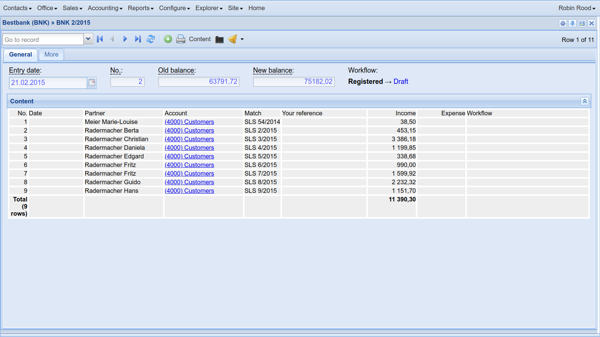
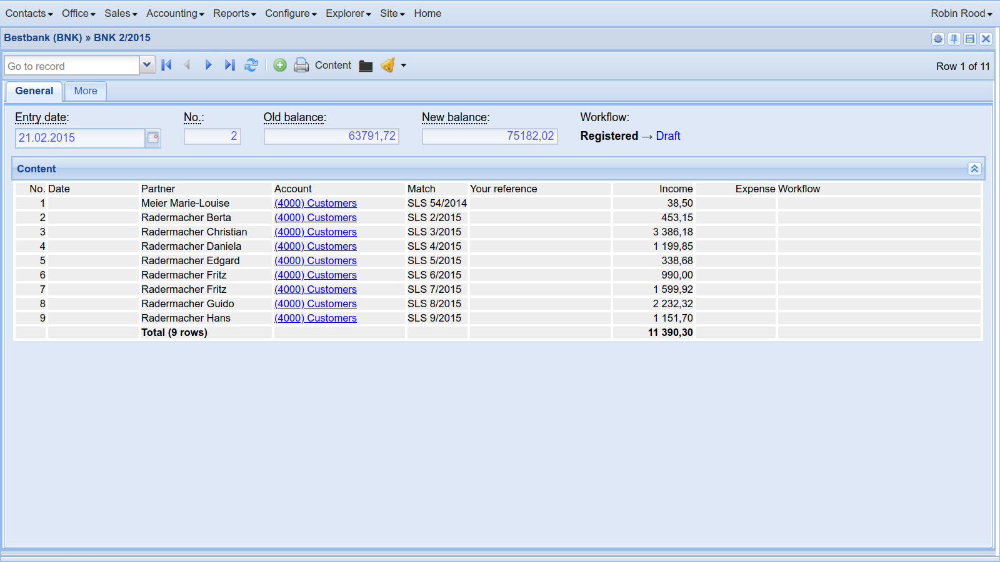

.. doctest docs/dev/format.rst

=================================
Customizing how data is formatted
=================================

There are many ways to customize how data is formatted when presented to the
end user.

.. currentmodule:: lino.core.model

.. class:: Model
  :noindex:

  .. attribute:: overview

    The text returned by :meth:`get_overview_elems`.

  .. method:: __str__(self)

    Return a translatable text that describes this :term:`database row`.

  .. attribute:: preferred_foreignkey_width = None

    The default preferred width (in characters) of widgets that
    display a ForeignKey to this model.

    If not specified, the default default `preferred_width`
    for ForeignKey fields is *20*.

  .. attribute:: summary_row_template = None

    An optional name of a template to use for :meth:`as_summary_row`.

  .. method:: as_summary_row(self, ar)

    Return a raw HTML string representing this object in a data view as a
    single paragraph.

    The string should represent a single ``
``.

    If :attr:`summary_row_template` is set, this will render this object
    using the named template, otherwise it will call :meth:`summary_row` and
    wrap the result into a paragraph.

  .. method:: summary_row(self, ar, **kw)

    Yield a sequence of ElementTree elements that represent this database
    object in a summary panel.

    The elements will be wrapped into a `
` by :meth:`as_summary_row`.

    The default representation is the text returned by :meth:`__str__` in a
    link that opens the detail view on this database object.

    The description may vary depending on the given action request.

    For example a partner model of a given application may want to always
    show the city of a partner unless city is among the known values::

        def summary_row(self, ar):
            elems = [ar.obj2html(self)]
            if self.city and not ar.is_obvious_field("city"):
                elems += [" (", ar.obj2html(self.city), ")"]
            return elems

    Note that this is called by the class method of same name on
    :class:`lino.core.actors.Actor`, which may be customized and may decide
    to not call the model method.

    TODO: rename this to `row2summary` and write documentation.

  .. method:: set_widget_options(self, name, **options)

    Set default values for the widget options of a given element.

    Usage example::

        JobSupplyment.set_widget_options('duration', width=10)

    has the same effect as specifying ``duration:10`` each time
    when using this element in a layout.

    List of widget options that can be set:

    `label`
    `editable`
    `width`
    `preferred_width`
    `preferred_height`
    `hide_sum`

Customizing the title of an actor
=================================

.. class:: lino.core.actors.Actor
  :noindex:

  .. attribute:: label = None

    The text to appear e.g. on a button that will call the default action of an
    actor.  This attribute is *not* inherited to subclasses.  If this is `None`,
    Lino will call :meth:`get_actor_label`.

  .. method:: get_title(self, ar)

    Return the title of this actor for the given action request `ar`.

    The default implementation calls :meth:`get_title_base` and
    :meth:`get_title_tags` and returns a string of type `BASE [
    (TAG, TAG...)]`.

    Override this if your table's title should mention for example
    filter conditions.  See also :meth:`Table.get_title
    <lino.core.dbtables.Table.get_title>`.

  .. method:: get_actor_label(self)

     Return the label of this actor.

  .. attribute:: title = None

    The text to appear e.g. as window title when the actor's default
    action has been called.  If this is not set, Lino will use the
    :attr:`label` as title.

  .. attribute:: button_text = None

    The text to appear on buttons of a ShowSlaveTable action for this
    actor.

  .. method:: get_title_base(self, ar)

    Return the base part of the title. This should be a translatable
    string. This is called by :meth:`get_title` to construct the
    actual title.

    It is also called by
    :meth:`lino.core.dashboard.DashboardItem.render_request`

  .. method:: get_title_tags(self, ar)

    Yield a list of translatable strings to be added to the base part
    of the title. This is called by :meth:`get_title` to construct
    the actual title.

Customizable Actor methods
==========================

.. class:: lino.core.actors.Actor
  :noindex:

  .. classmethod:: get_row_classes(self, ar)

    If a method of this name is defined on an actor, then it must
    be a class method which takes an :class:`ar
    <lino.core.requests.BaseRequest>` as single argument and
    returns either None or a string "red", "green" or "blue"
    (todo: add more colors and styles). Example::

        @classmethod
        def get_row_classes(cls,obj,ar):
            if obj.client_state == ClientStates.newcomer:
                return 'green'

    Defining this method will cause an additional special
    `RowClassStoreField` field in the :class:`lino.core.Store`
    objects of this actor.

  .. attribute:: details_of_master_template = _("%(details)s of %(master)s")

    Used to build the title of a request on this table when it is a
    slave table (i.e. :attr:`master` is not None). The default value
    is defined as follows::

        details_of_master_template = _("%(details)s of %(master)s")

  .. attribute:: window_size = None

    Set this to a tuple of `(height, width)` to have this actor
    display in a modal non-maximized window.

    - `height` must be either an integer expressing a number of rows
      or the string "auto".  If it is auto, then the window should not
      contain any v-flexible component.

    - `width` must be either an integer expressing a number of rows
      or a string of style "90%".

      Note that a relative width will be converted to a number of
      pixels when the window is rendered for the first time. That is,
      if you close the window, resize your browser window and reopen
      the same window, you will get the old size.

  .. attribute:: insert_layout_width = 60

    When specifying an :attr:`insert_layout` using a simple a multline
    string, then Lino will instantiate a FormPanel with this width.

  .. attribute:: hide_window_title = False

    This is set to `True` e.h. in home pages
    (e.g. :class:`lino_welfare.modlib.pcsw.models.Home`).

  .. attribute:: hide_headers = False
    Set this to True in order to hide the column headers.

    This is ignored when the table is rendered in an ExtJS grid.

  .. attribute:: hide_top_toolbar = False

    Whether a Detail Window should have navigation buttons, a "New"
    and a "Delete" buttons.  In ExtJS UI also influences the title of
    a Detail Window to specify only the current element without
    prefixing the Tables's title.

    If used in a grid view in React will remove the top toolbar
    and selection tools.

    This option is `True` in
    :class:`lino.models.SiteConfigs`,
    :class:`lino_welfare.pcsw.models.Home`,
    :class:`lino.modlib.users.desktop.MySettings`,
    :class:`lino_xl.cal.CalenderView`.

  .. attribute:: detail_layout = None

    Define the layout to use for the detail window.  Actors with
    :attr:`detail_layout` will get a `show_detail` action.

    When you define a :attr:`detail_layout`, you will probably also
    want to define a :attr:`insert_layout`.

    The :attr:`detail_layout` is normally an instance of
    :class:`DetailLayout <lino.core.layouts.DetailLayout>` or a
    subclass thereof.  For example::

        class FooDetail(dd.DetailLayout):
            ...

        class Foos(dd.Table):
            ...
            detail_layout = FooDetail()

    It is possible and recommended to specify :attr:`detail_layout` as
    a string, in which case it will be resolved at startup as follows:

    If the string contains at least one newline (or no newline and
    also no dot) then it is taken as the :attr:`main` of a
    :class:`DetailLayout <lino.core.layouts.DetailLayout>`.
    For example::

        class Foos(dd.Table):
            ...
            detail_layout = """
            id name
            description
            """

    If the string contains a dot ('.') and *does not contain* any
    newlines, then Lino takes this as the name of the class to be
    instantiated and used.

    For example::

        class Courses(dd.Table):
            ...
            detail_layout = 'courses.CourseDetail'

    This feature makes it possible to override the detail layout in an
    extended plugin. Before this you had to define a new class and to
    assign an instance of that class to every actor which uses it.
    But e.g. in :mod:`lino_xl.lib.courses` we have a lot of subclasses
    of the :class:`Courses` actor.

  .. method:: insert_layout = None

    Define the form layout to use for the insert window.

    If there's a :attr:`detail_layout` but no :attr:`insert_layout`,
    the table won't have any (+) button to create a new row via a
    dialog window, but users can still create rows by writing into the
    phantom row. Example of this is
    :class:`lino_xl.lib.courses.Topics` which has a detail layout
    with slave tables, but the model itself has only two fields (id
    and name) and it makes no sense to have an insert window.

  .. attribute:: help_text = None

    A help text that shortly explains what the default action of this
    actor does.  In a graphical user interface this will be rendered
    as a **tooltip** text.

    If this is not given by the code, Lino will potentially set it at
    startup when loading the :xfile:`help_texts.py` files.

  .. method:: summary_row(cls, ar, obj, **kw)

    Return a HTML representation of the given data row `obj` for usage in a
    summary panel.

    The default implementation calls
    :meth:`lino.core.model.Model.summary_row`.

.. _dev.actors.sums:

Showing, hiding and formatting sums
===================================

.. currentmodule:: lino.core.actors

.. class:: lino.core.actors.Actor
  :noindex:

  .. attribute:: sum_text_column = 0

    The index of the column that should hold the text to display on the totals
    row (returned by :meth:`get_sum_text`).

  .. method:: get_sum_text(self, ar, sums)

    Return the text to display on the totals row.
    The default implementation returns "Total (N rows)".

Lino automatically assumes that you want a sum for every numeric field.
Sometimes this is now waht you want.  In that case you can say::

    MyModel.set_widget_option('year", show_sum=False)

When a table has at least one column with a sum, Lino adds a "totals" line when
printing the table.  The first empty column in that line will receive a text
"Total (9 rows)".  That text is customizable by overriding
:meth:`Actor.get_sum_text`.

If you don't want that text to appear in the first empty column, you can
specify a value for :attr:`Actor.sum_text_column`.  Usage example:  the first
screenshot below is without :attr:`Actor.sum_text_column`, the second is with
:attr:`sum_text_column` set to 2:

