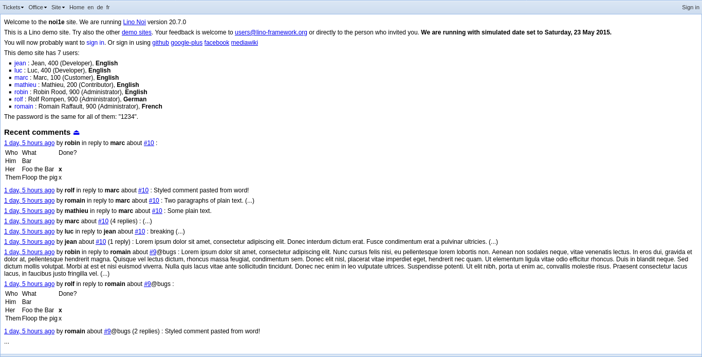
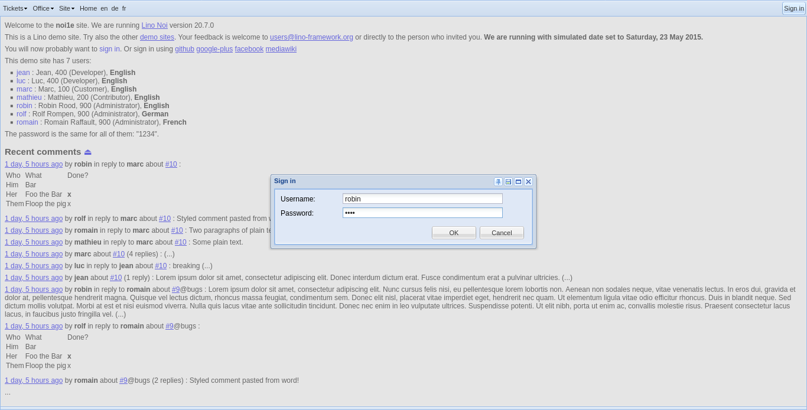
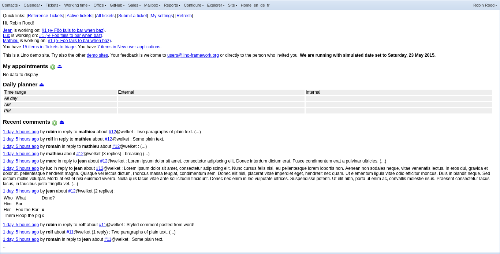
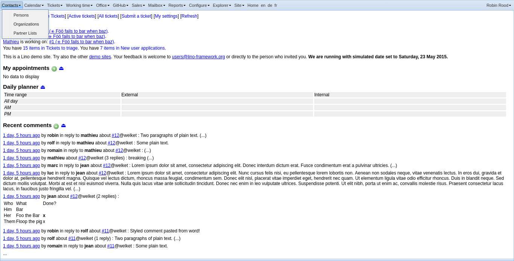
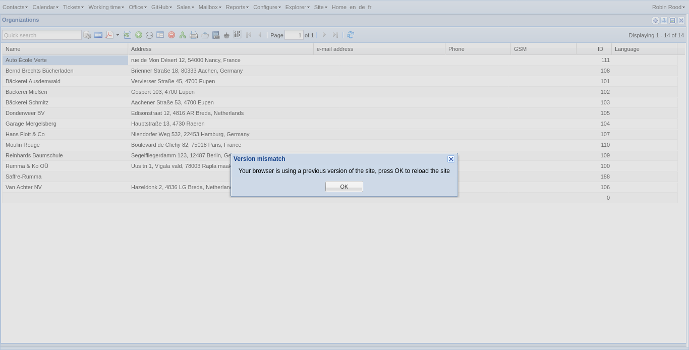

.. _noi1e.tour:

====================================
A tour of the Noi/ExtJS demo project
====================================

A series of screenshots taken from the
:mod:`lino_book.projects.noi1e.settings.demo` demo project.

.. include:: /../docs/shared/include/defs.rst

-----------------
Before signing in
-----------------

----------------
The login window
----------------

---------------
The main screen
---------------

-----------------
The Contacts menu
-----------------

-------------------------
The list of organizations
-------------------------

.. _noi1e.tour.oops:

------------
Not finished
------------

Oops, we had a problem when generating this document::

    Traceback (most recent call last):
      File "/home/luc/work/lino/lino/api/selenium.py", line 292, in run_from_server
        self.main_func(self)
      File "maketour.py", line 113, in main
        tour(a, user)
      File "maketour.py", line 102, in tour
        app.find_clickable(str(user)).click()
      File "/home/luc/virtualenvs/py3/lib/python3.6/site-packages/selenium/webdriver/remote/webelement.py", line 80, in click
        self._execute(Command.CLICK_ELEMENT)
      File "/home/luc/virtualenvs/py3/lib/python3.6/site-packages/selenium/webdriver/remote/webelement.py", line 633, in _execute
        return self._parent.execute(command, params)
      File "/home/luc/virtualenvs/py3/lib/python3.6/site-packages/selenium/webdriver/remote/webdriver.py", line 321, in execute
        self.error_handler.check_response(response)
      File "/home/luc/virtualenvs/py3/lib/python3.6/site-packages/selenium/webdriver/remote/errorhandler.py", line 242, in check_response
        raise exception_class(message, screen, stacktrace)
    selenium.common.exceptions.ElementClickInterceptedException: Message: Element <button id="ext-gen52" class=" x-btn-text" type="button"> is not clickable at point (1321,14) because another element 
 obscures it
    

